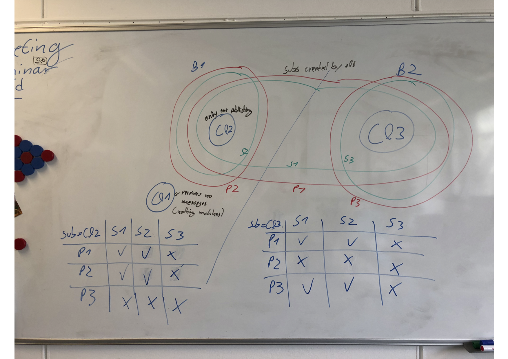

# DisGB Scenario

This scenario validates that both DisGB modes, matching at the publisher and matching at the subscriber, run as 
intended.

The general setup is as follows:

## Broker Areas

Each broker covers a circular area with a diameter of 6°. The center of B1's broker area is Paris (48.86, 2.35), 
the center of B2's broker area is Berlin (52.52, 13.40).
Thus, from now on, B1 is referred to as "Paris" and B2 is referred to as "Berlin".

## Scope

While this scenario also tests some corner and failure cases, this is not the overall goal. Instead, it should be 
tested if these following operations in the given order work as intended when the clients behave as intended.
- connect
- pingreq
- subscribe
- publish
- unsubscribe
- disconnect